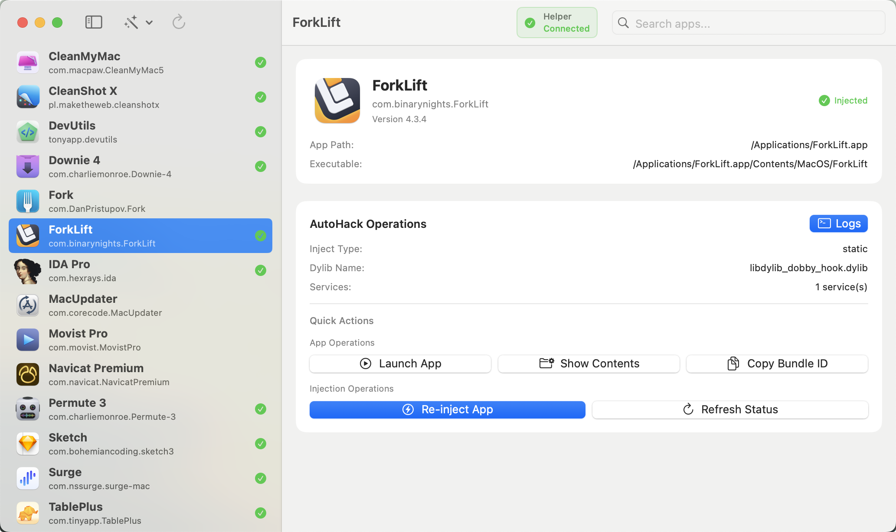
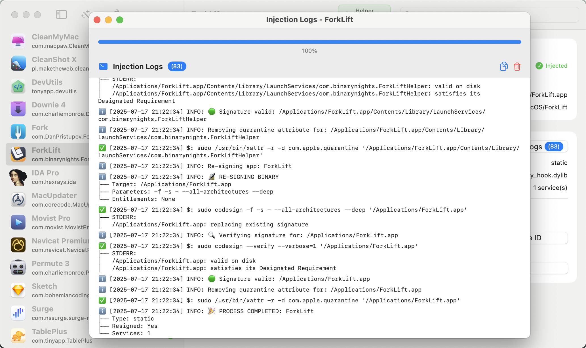
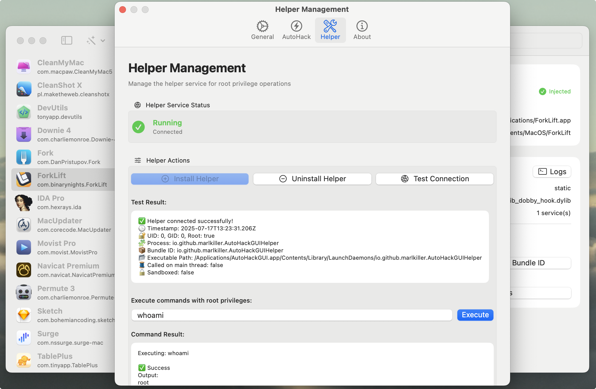

# AutoHackGUI

一个现代、优雅的 macOS 图形工具，助你高效管理 APP 注入配置与操作，支持密码注入与 Helper 注入。

---

## 主要特性

- **应用注入管理**：一键完成静态或动态注入  
- **配置可视化**：自动加载 JSON 配置，支持多种注入方式  
- **状态监控**：实时展示注入状态与服务运行情况  
- **日志追踪**：清晰记录每一步操作日志  
- **权限管理**：内建 Helper 服务，支持 root 权限操作  

---

## 界面预览

  
  
  

---

## 快速开始

建议前往以下页面下载最新版本的 AutoHackGUI 应用安装包：

👉 [点击下载 AutoHackGUI Releases](https://github.com/marlkiller/AutoHackGUI-Releases/releases)

如首次打开时遇到 macOS 报错提示：

> Apple无法验证“AutoHackGUI.app”是否包含可能危害Mac安全或泄漏隐私的恶意软件提示


请在终端执行以下命令以移除应用的隔离标记：

```bash
/usr/bin/xattr -r -d com.apple.quarantine "/Applications/AutoHackGUI.app"
```

