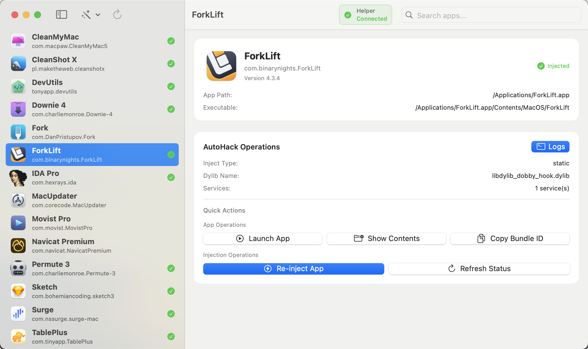
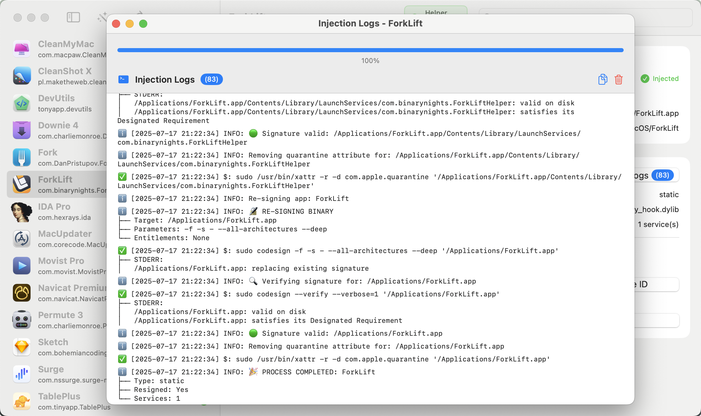
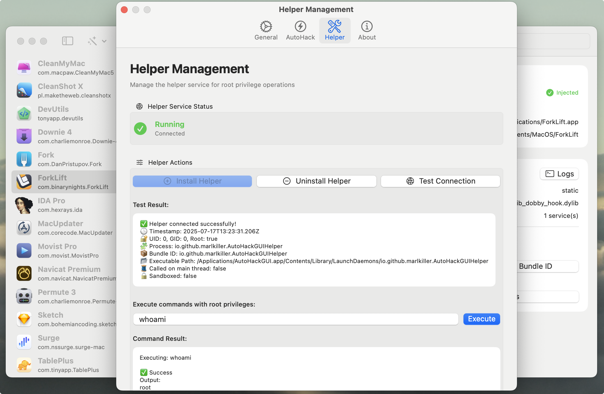

## AutoHackGUI

轻量、安静的 macOS 注入工具  
A minimal, quiet macOS injection helper

---

## 特性 Features

- 应用注入管理（静态 / 动态）  
  App injection (static / dynamic)

- JSON 配置自动加载  
  Auto-load JSON configs

- 实时状态与日志  
  Live status & logs

- 内建 Helper（支持权限操作）  
  Built-in helper (privileged tasks)

---

## 预览 Preview

  
  


---

## 下载 Download

Releases:  
https://github.com/marlkiller/AutoHackGUI-Releases/releases

---

## 首次打开 First Launch

若被 macOS 拦截：  
If blocked by macOS:

```bash
/usr/bin/xattr -r -d com.apple.quarantine "/Applications/AutoHackGUI.app"
